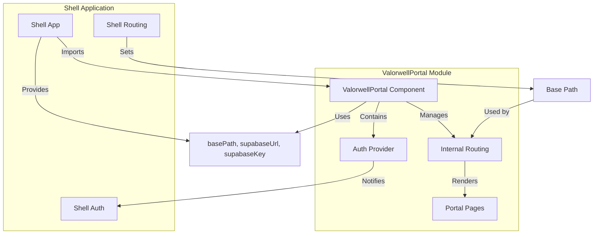

# Valorwell Client Portal

A React-based client portal application that can be run as a standalone app or consumed as a micro-frontend module.

## Project Overview

The Valorwell Client Portal is a comprehensive web application designed to provide client management functionality. It offers:

- A complete standalone application with its own routing and authentication
- A micro-frontend module that can be integrated into larger shell applications
- Authentication and user management via Supabase
- Client profile management and document handling
- Appointment scheduling and management

The application is built with modern web technologies and follows a component-based architecture that enables flexible deployment options.

## Dual Mode Operation

This application supports two modes of operation:

### 1. Standalone Mode (Development)
Run the portal as an independent application for development:

```sh
# Install dependencies
npm install

# Start development server
npm run dev
```

The app will be available at `http://localhost:8080`

### 2. Micro-Frontend Module Mode
Build the portal as a module for consumption by a shell application:

```sh
# Install dependencies
npm install

# Build as library/module
npm run build:lib
```

This outputs `dist/valorwell-portal.js` which can be consumed by a shell application. The build process sets the `BUILD_MODE=library` environment variable, which configures Vite to build the application as a library rather than a standalone application.

## Micro-Frontend Integration

### Consuming the Module

The ValorwellPortal component is the main export of the module and serves as the entry point for integration:

```typescript
import { ValorwellPortal } from './path/to/valorwell-portal.js';

// Basic usage
<ValorwellPortal />

// With configuration
<ValorwellPortal 
  basePath="/portal" 
  supabaseUrl="https://your-project.supabase.co"
  supabaseKey="your-anon-key"
  onAuthStateChange={(user, session) => {
    console.log('Auth state changed:', user, session);
  }}
/>
```

### Integration Architecture



### Props

| Prop | Type | Default | Description |
|------|------|---------|-------------|
| `basePath` | `string` | `''` | Base path for routing (e.g., `/portal`). This is used to prefix all internal routes within the module. |
| `supabaseUrl` | `string` | `undefined` | Supabase project URL. This is required for the module to connect to your Supabase instance. |
| `supabaseKey` | `string` | `undefined` | Supabase anon key. This is required for the module to authenticate with your Supabase instance. |
| `onAuthStateChange` | `function` | `undefined` | Callback for auth state changes. This allows the shell application to respond to authentication events from the module. |

### Detailed Integration Example

Here's a more comprehensive example of how to integrate the module in a React application:

```typescript
import React from 'react';
import { ValorwellPortal } from 'valorwell-portal';

function App() {
  // Handle auth state changes from the portal
  const handleAuthStateChange = (user, session) => {
    if (user) {
      console.log('User authenticated:', user.id);
      // Update your app's auth state
      // For example, store the user in your app's context or state management
    } else {
      console.log('User signed out');
      // Clear your app's auth state
    }
  };

  return (
    <div className="app-container">
      <header>
        <h1>My Application</h1>
        <nav>{/* Your app navigation */}</nav>
      </header>
      
      <main>
        {/* 
          Mount the ValorwellPortal with configuration.
          The basePath should match your routing configuration.
        */}
        <ValorwellPortal 
          basePath="/portal"
          supabaseUrl={process.env.REACT_APP_SUPABASE_URL}
          supabaseKey={process.env.REACT_APP_SUPABASE_ANON_KEY}
          onAuthStateChange={handleAuthStateChange}
        />
      </main>
      
      <footer>
        {/* Your app footer */}
      </footer>
    </div>
  );
}

export default App;
```

## Environment Variables

Create a `.env` file based on `.env.example`:

```sh
cp .env.example .env
```

The following environment variables are supported:

- `VITE_SUPABASE_URL` - Supabase project URL
- `VITE_SUPABASE_ANON_KEY` - Supabase anonymous key

### Environment Variables in Shell Applications

When integrating the ValorwellPortal as a micro-frontend, you should provide the Supabase configuration through props rather than environment variables. However, you can still use environment variables in your shell application to manage these values:

```typescript
// In your shell application
<ValorwellPortal 
  supabaseUrl={process.env.REACT_APP_SUPABASE_URL}
  supabaseKey={process.env.REACT_APP_SUPABASE_ANON_KEY}
/>
```

## Configuration Priority

The application resolves Supabase configuration in the following order:

1. **Runtime props** (highest priority) - passed to `ValorwellPortal` component
2. **Environment variables** - from `.env` file or environment
3. **Fallback values** (lowest priority) - hardcoded development values

This prioritization ensures that the module can be configured flexibly based on the deployment context.

## Development Workflow

### Local Development (Standalone)
```sh
npm run dev
```

This starts a development server with hot module replacement, allowing you to develop and test the application as a standalone app.

### Building for Production (Standalone)
```sh
npm run build
```

This builds the application for production deployment as a standalone application.

### Building as Module
```sh
npm run build:lib
```

This builds the application as a module that can be consumed by other applications.

### Testing the Module Integration

To test the module integration with a shell application:

1. Build the module:
   ```sh
   npm run build:lib
   ```

2. Copy or link the output file (`dist/valorwell-portal.js`) to your shell application.

3. Import and use the module in your shell application:
   ```typescript
   import { ValorwellPortal } from './path/to/valorwell-portal.js';
   ```

4. Run your shell application and verify that the integration works as expected.

### Type Checking
```sh
npm run type-check
```

This runs TypeScript type checking to ensure type safety across the codebase.

## Technologies

This project is built with:

- **Vite** - Build tool and dev server
- **TypeScript** - Type safety
- **React** - UI framework
- **React Router** - Client-side routing
- **Supabase** - Backend and authentication
- **shadcn-ui** - Component library
- **Tailwind CSS** - Styling
- **Tanstack Query** - Data fetching

## Architecture

### Standalone Mode
```
App.tsx (BrowserRouter + AuthProvider + Routes)
├── Public Routes (/, /login, /signup)
├── Protected Routes (/dashboard, /profile, etc.)
└── Auth Protected Routes with role checks
```

### Module Mode
```
ValorwellPortal (exported component)
├── Configurable basePath for routing
├── Runtime Supabase configuration
├── Auth state callbacks for shell integration
└── Same route structure as standalone
```

## Authentication

The portal uses Supabase authentication with:

- Email/password login and signup
- Password reset functionality
- Role-based access control
- Session persistence
- Auth state synchronization with shell apps (in module mode)

When used as a micro-frontend module, the ValorwellPortal component provides an `onAuthStateChange` callback that notifies the shell application of authentication events. This allows the shell application to synchronize its authentication state with the module.

## Deployment

### Standalone Deployment
Deploy the built assets from `npm run build` to any static hosting service.

### Module Deployment
1. Build the module: `npm run build:lib`
2. Publish the `dist/valorwell-portal.js` file
3. Import and use in your shell application

## Custom Domains

For custom domains, refer to the [Lovable documentation](https://docs.lovable.dev/tips-tricks/custom-domain/).

## Support

For issues and questions, please refer to the project documentation or contact the development team.
