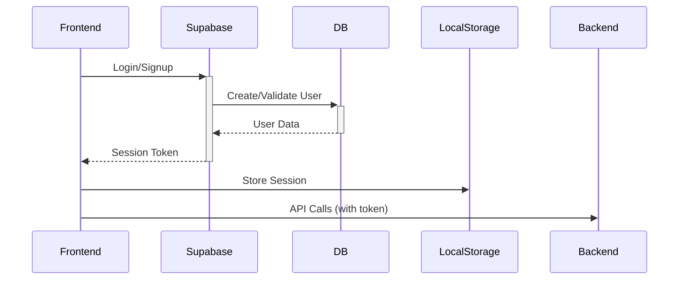

# Supabase Authentication Integration Analysis Report

## Current Implementation Overview

### Auth Flow Architecture


### Key Components
1. **Client Integration** (`src/integrations/supabase/client.ts`)
   - Initializes Supabase client
   - Configures auth persistence
   - Sets up auto-refresh

2. **Auth Service** (`src/services/AuthService.ts`)
   - Manages auth state machine
   - Handles session refresh
   - Implements role checks

3. **Edge Functions**
   - `create-user`: Handles user creation with temp passwords
   - `delete-user`: Admin-only user deletion

4. **Database Schema**
   - Role-based tables (admins, clinicians, clients)
   - Migration-based user provisioning

## Identified Issues

### Security Concerns
1. **Session Management**
   - Reliance on localStorage (vulnerable to XSS)
   - No token encryption
   - Basic session validation (missing JWT verification)

2. **User Provisioning**
   - Weak temporary passwords (16 chars alphanumeric)
   - No email validation
   - Plaintext temp password storage

3. **Role Management**
   - Basic role validation
   - No permission granularity
   - Limited audit logging

### Data Flow Problems
1. **State Synchronization**
   - No reconciliation between client/server states
   - Limited error recovery

2. **Error Handling**
   - Basic error messages may expose system details
   - Inconsistent error logging

3. **Performance**
   - No rate limiting
   - No session caching

## Recommendations

### Immediate Fixes (High Priority)
1. **Session Security**
   - Implement HttpOnly cookies for sessions
   - Add JWT signature verification
   - Encrypt localStorage data

2. **User Management**
   - Enforce password policies
   - Implement email verification
   - Hash temporary passwords

3. **Error Handling**
   - Standardize error responses
   - Implement proper error classification

### Architectural Improvements
1. **State Management**
   - Implement periodic state reconciliation
   - Add session invalidation webhooks

2. **Monitoring**
   - Enhance audit logging
   - Add auth operation metrics

3. **Performance**
   - Implement rate limiting
   - Add session caching layer

### Data Flow Diagram (Proposed)
```mermaid
graph LR
    A[Frontend] -->|Encrypted Tokens| B[Supabase]
    B -->|Webhooks| C[Backend]
    C -->|State Sync| A
    B --> D[(Database)]
    D -->|Audit Logs| E[Monitoring]