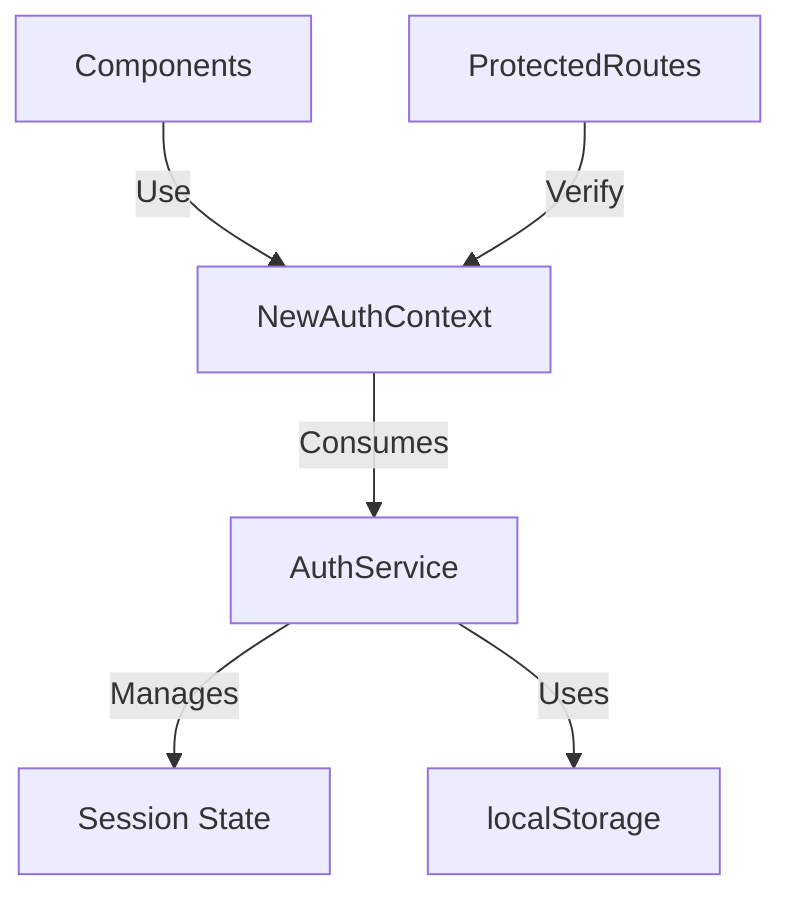

# Authentication System Migration Plan

## Current Architecture Analysis

### Implementation Status
✅ **NewAuthContext Adoption**  
- Fully implemented across 30+ components  
- Provides consistent auth state management  
- Uses single 'auth_session_cache' localStorage key  

✅ **Legacy System Removal**  
- UserContext completely removed from production code  
- Legacy localStorage keys properly cleaned up  

### Key Components

## Migration Tasks

### 1. localStorage Consolidation
- [ ] Remove `authCleanup.ts` (legacy key cleanup)
- [ ] Update debug utilities to only check 'auth_session_cache'
- [ ] Verify all auth data uses single key

### 2. AuthState Standardization
- [ ] Audit all enum usage
- [ ] Remove duplicate definitions
- [ ] Update documentation

### 3. Testing Requirements
**Unit Tests:**
- [ ] AuthService session persistence  
- [ ] NewAuthContext state transitions  
- [ ] ProtectedRoute behavior  

**Integration Tests:**
- [ ] Login/logout flow  
- [ ] Session timeout handling  
- [ ] Role-based routing  

## Risk Assessment

| Risk Area | Level | Mitigation Strategy |
|-----------|-------|---------------------|
| Session Timeout | Medium | Centralize in AuthService |
| Error Recovery | Medium | Enhanced logging |
| Legacy Key Removal | Low | Backward compatible |

## Recommended Improvements
1. Centralize timeout handling in AuthService
2. Enhance debug utilities with:
   - Session validation
   - State transition logging
3. Add comprehensive operational logging

## Timeline
1. **Week 1**: Finalize and review plan  
2. **Week 2**: Implement changes  
3. **Week 3**: Testing and validation  
4. **Week 4**: Documentation updates